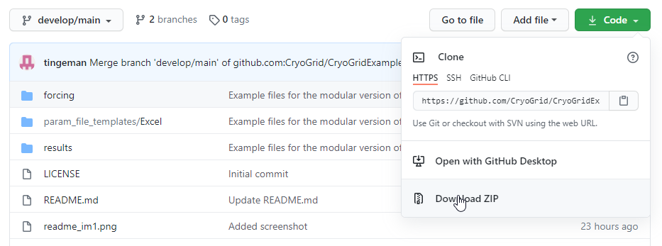
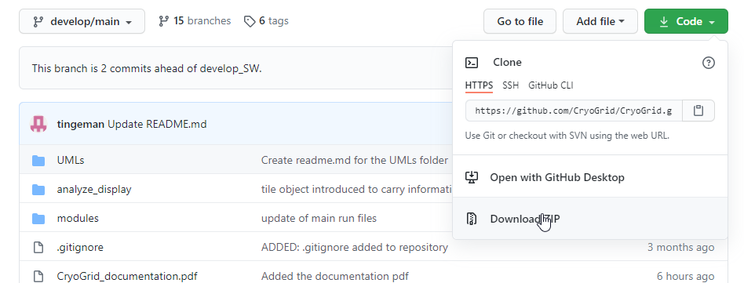

# Quick Start

## Software requirements
CryoGrid is written in [Matlab](https://www.mathworks.com/products/matlab.html). Version 2018x or higher is required.

## Known Limitations
- Multi-tile (3D) functionality not yet implemented.
- The writing of this documentation is in progress and not yet complete. There is a pdf file available with more in depth explanation of the model ([CryoGrid_documentation.pdf](./CryoGrid_documentation.pdf)). The information from this document will be gradually included in this documentation.

## Brief model description
CryoGrid is a simulation tool to calculate ground temperatures and volumetric water/ice contents (as well as salt concentration, etc. depending on the selected `SUBSURFACE` classes) in single-tile (1D) stratigraphies. Multi-tile (3D) models can be realized by coupling several 1D stratigraphies.

A stratigraphy is realized by stacking one or several `SUBSURFACE` classes, which each account for different physical processes. The different `SUBSURFACE` classes typically have specific state variables and model parameters and use different constitutive equations to calculate those variables.

## Get started - getting code and examples for running your first model

Here we describe how to set up the code to run an initial test model as a first time user.
We have a separate section on obtaining the necessary files through git: [see below](#git_download)

### Get the test examples

First download the test example from the github repository [CryoGrid/CryoGridExamples](https://github.com/CryoGrid/CryoGridExamples/tree/develop/main). You may download the repository contents as a zip-file, by clicking the green `code` button and choose `Download Zip`. See screenshot below.
(In the upper left hand corner, make sure the `develop/main` branch is selected).



Unzip the the contents to your preferred folder, f.ex. `c:\my_matlab_code\cryogrid\`.
You will now have the following folder structure: `c:\my_matlab_code\cryogrid\CryoGridExamples-develop-main`, which will contain example run files and model definitions.
Rename this folder:

```
rename c:\my_matlab_code\cryogrid\CryoGridExamples-develop-main c:\my_matlab_code\cryogrid\CryoGridExamples
```

### Get the main CryoGrid code

Download the main CryoGrid code as zip-file. From the main GitHub repository page, click the green `code` button and choose `Download Zip`. See screenshot below.
(In the upper left hand corner, make sure the `develop/main` branch is selected).



Now unzip the contents of the zip file  to the folder `c:\my_matlab_code\cryogrid\CryoGridExamples`.
You will now have the following folder structure: `c:\my_matlab_code\cryogrid\CryoGridExamples\CryoGrid-develop-main`
Rename this folder:
```
rename c:\my_matlab_code\cryogrid\CryoGridExamples\CryoGrid-develop-main c:\my_matlab_code\cryogrid\CryoGridExamples\CryoGrid
```

### <a name="run_model"></a>Run the test model 

Open MatLab and change the path to `c:\my_matlab_code\cryogrid\CryoGridExamples\`. This can be done either using the MatLab path selector dialog, or by typing in the command window:

`cd c:\my_matlab_code\cryogrid\CryoGridExamples\`

Change the paths according to the actual install folder you chose for the example code.

To run the example model, in the MatLab terminal run the file run_CG.m file by typing:

`run_CG`

The code will start running. It will produce one ouput file per year, which is written to disc at a specific date (defined in the parameter Excel file `c:\my_matlab_code\cryogrid\CryoGridExamples\results\test\test.xlsx`). You can stop the code any time after a full year has been calculated (to ensure you have an output file written to disc).

The first output file written to disc by the example model will have the name `c:\my_matlab_code\cryogrid\CryoGridExamples\results\test\test_19800901.mat`.

### View the output of the model

To plot the results, change the path to `c:\my_matlab_code\cryogrid\CryoGridExamples\CryoGrid\analyze_display\`:

```
cd c:\my_matlab_code\cryogrid\CryoGridExamples\CryoGrid\analyze_display\
load(`c:\my_matlab_code\cryogrid\CryoGridExamples\results\test\test_19810901.mat`)
read_display_out()
```

Plots will be generated for several parameters. Not all of them are meaningful for all model configurations. Find and inspect the figure showing the temperature field.

### To change the model parameters

The model is defined in the file `c:\my_matlab_code\cryogrid\CryoGridExamples\results\test\test.xlsx`.
You may play around with the model parameters and se how the output changes.

For example, you could change the thickness of layer 1:

- Open the excel file
- Find the section `STRAT_layers`
- First column in the defined matrix lists the depth to the bottom of each layer (so row 1 has the depth to the bottom of layer 1)
- The first layer is by default from 0 - 0.5 m (0.5 m thick).
- To change the thickness of the first layer to 1 m, simply change the value from 0.5 to 1.

Rerun the model to see the changes. (Be aware that the out files are overwritten, back them up if you want to store for comparison.)


### <a name="git_download"></a>Getting the code and examples using the git commandline tool

1. Clone the CryoGridExamples repository to a new directory (fx `c:\my_matlab_code\cryogrid`): 

```
git clone --single-branch --branch develop/main https://github.com/CryoGrid/CryoGridExamples.git
```

2. Navigate into the new directory `c:\my_matlab_code\cryogrid\CryoGridExamples`

```
cd c:\my_matlab_code\cryogrid\CryoGridExamples
```

3. Clone the main CryoGrid model code

```
git clone --single-branch --branch develop/main https://github.com/CryoGrid/CryoGrid.git
```

Continue with running the model as described [above](#run_model)


